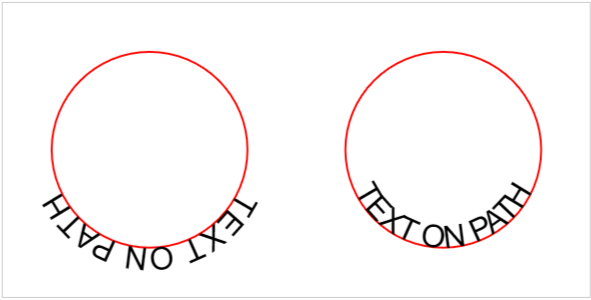

# A JS polyfill for missing `textPath` side browser support
**Disclaimer** this repo is rather a proof of concept and not production-ready!

## The problem text-on-path alignment
Graphic applications support to move text on paths to the inside or outside for decades.  

 

Replicating this functionality in SVG is unfortunately cumbersome.  
Mozilla Firefox is to this date the only browser which support the [`side`](https://developer.mozilla.org/en-US/docs/Web/SVG/Reference/Attribute/side) attribute

## How it works
The polyfill checks, whether `side` is supported natively – if not it clones `textPath` definitions and reverses the drawing directions. 

Basically, we're simply reversing the path.

## Recommendations
You should rather copy the hard-coded reversed pathData to get the desired alignment than applying the polyfill dynamically in runtime.
